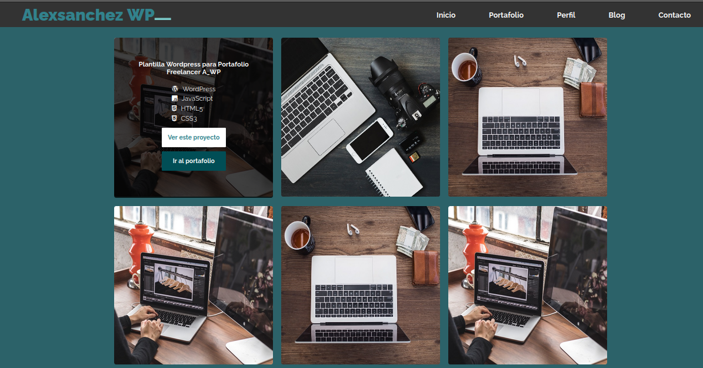

## Hola, gracias por visitar mi perfil

Esta es una plantilla pensada para un portafolio IT, developer o web designer; desarrollada 100% con `HTML5`, `CSS3` y `JavaScript Vanilla`, está en proceso de construcción, pero siéntete libre de clonarla, mejorarla y utilizarla para el uso que le quieras dar.

### Librerias 

 - [fontawesome 4](https://fontawesome.com/)
 - [normalize](https://necolas.github.io/normalize.css/)
 - [Google Fonts](https://fonts.google.com/)
 - [undraw](https://undraw.co)
 - [unsplash](https://unsplash.com/)

 #### Pronto para React, Flask y Laravel... 

 
